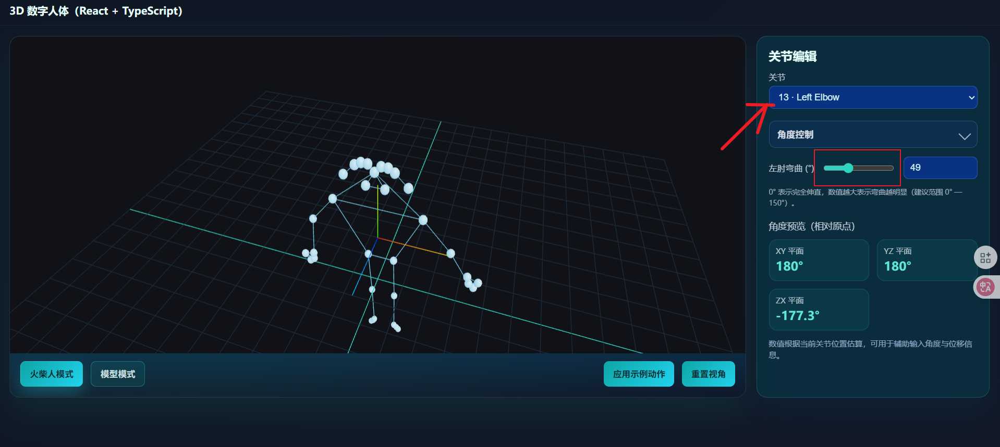

# 简要说明
该项目是react项目

### 项目启动相关
#### 项目依赖
> node 版本至少 v20

```
pnpm i 或者 npm i
```

#### 项目启动
```
pnpm dev 或者 npm run dev
```


### 项目与3d模型构建(此方案待定)


- 方案一: mediapipe 是基于2d算法点阵形成的骨骼识别.如果必须要识别3d,就得把模型拍成很多图片,然后进行识别(挺画蛇添足的做法)
- 方案二: 手动制作相关模型,模型上的所有节点是可识别的,且都需要与一个标准的规则进行映射(需要提供相关文件)

### 目前的演示规则


``` tsx
const JOINT_CONFIGS: Record<number, JointConfig> = {
  // 单轴铰链关节
  13: { parent: 11, child: 15, dependents: [17, 19, 21], min: 0, max: 150, label: '左肘', type: 'hinge' },
  14: { parent: 12, child: 16, dependents: [18, 20, 22], min: 0, max: 150, label: '右肘', type: 'hinge' },
  25: { parent: 23, child: 27, dependents: [29, 31], min: 0, max: 160, label: '左膝', type: 'hinge' },
  26: { parent: 24, child: 28, dependents: [30, 32], min: 0, max: 160, label: '右膝', type: 'hinge' },
  // 多轴球关节（肩）
  11: { parent: 0, child: 13, dependents: [15, 17, 19, 21], label: '左肩', type: 'ball', elevationMin: -180, elevationMax: 180, rotationMin: -90, rotationMax: 90 },
  12: { parent: 0, child: 14, dependents: [16, 18, 20, 22], label: '右肩', type: 'ball', elevationMin: -180, elevationMax: 180, rotationMin: -90, rotationMax: 90 },
  // 多轴球关节（髋）
  23: { parent: 24, child: 25, dependents: [27, 29, 31], label: '左髋', type: 'ball', elevationMin: -90, elevationMax: 90, rotationMin: -45, rotationMax: 45 },
  24: { parent: 23, child: 26, dependents: [28, 30, 32], label: '右髋', type: 'ball', elevationMin: -90, elevationMax: 90, rotationMin: -45, rotationMax: 45 }
}
```
